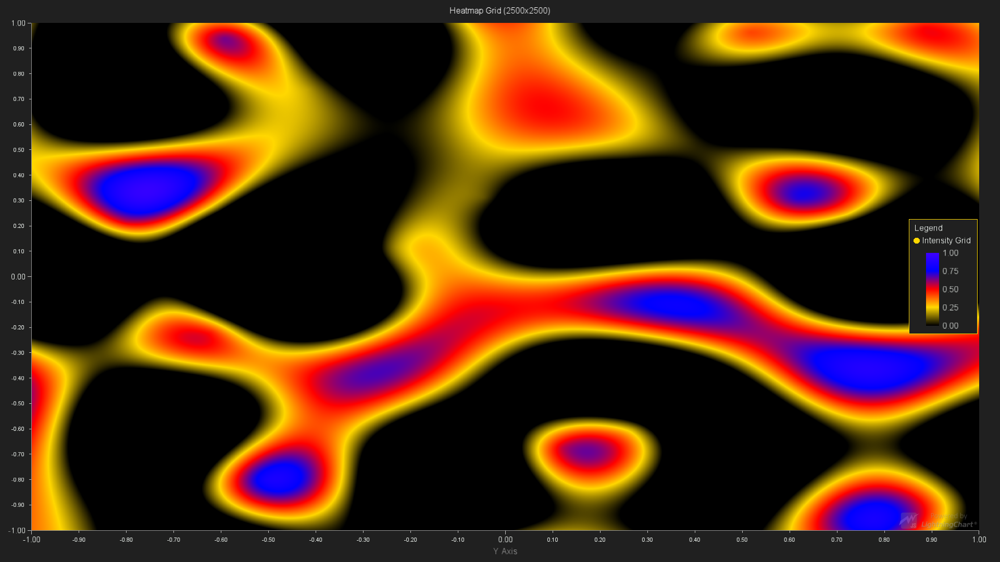

# LightningChart JS server side rendering test

Simple `Node.js` script that generates random test data and renders it with `LightningChart JS`, a hardware accelerated data visualization library.



The rendered chart is saved into a local file `frame.png`.

Usage:

```bash
npm i
npm start
```

Learn more about `LightningChart JS` [here](https://www.arction.com/lightningchart-js/).
